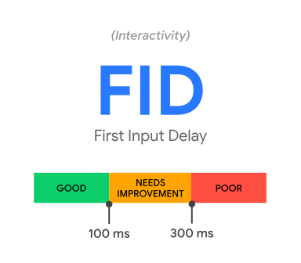

web指标是Google推出的

核心web指标侧重于用户体验的三个方面：

加载性能、交互性和视觉稳定性

其中每个方面对应的关键指标如下

- 加载性能关键指标 LCP
  
    Largest Contentful Paint（LCP）最大内容绘制，测量加载性能。为了提供良好的用户体验，LCP应在页面首次开始加载后的2.5秒内发生

- 交互性关键指标首次输入延迟
  
    First Input Delay（FID）首次输入延迟，测量交互性。为了提供良好的用户体验，页面的FID应为100毫秒或更短

- 视觉稳定性关键指标累积布局偏移
  
    Cumulative Layout Shift（CLS）累积布局偏移，测量视觉稳定性，为了提供良好的用户体    验，页面的CLS应保持在0.1或更少

如果一个页面满足上述全部三项指标建议目标值的第 75 个百分位数，那么评估核心 Web 指标合规性的工具应评判该页面为通过。

#### FP

#### FCP

#### LCP

#### DCL

#### FMP

#### L

#### TTI

#### TBT

#### FID

#### CLS SI